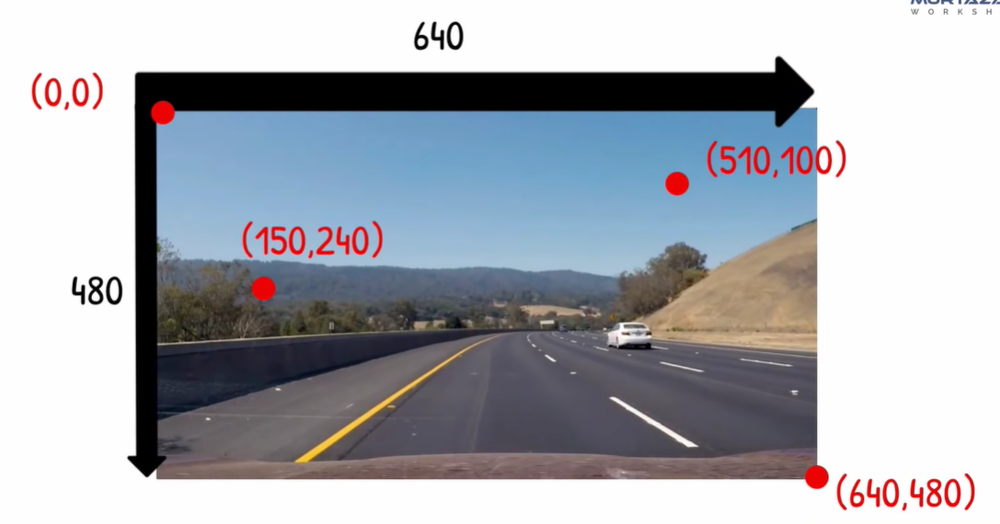

# OpenCV

# Chapter1. Img read

```python
import cv2
print("Package Imported")

cv2.imread()  #>read image
cv2.imshow("output",image) # img 보여줌
cv2.waitKey(0) #반드시 필요 없으면 안나옴
```

# Chapter2. Transfer Charetistic

- Color
- Blur
- Canny
- Dialation
- Eroded

# Chapter3. Img Resize



# Chapter5. Img Rotation

```python
matrix = cv2.getPerspectiveTransform(pts1,pts2)
imgOutput = cv2.warPerspective(img,matrix,(width,height)
```

# Chapter6. Joining Img

# Chapter7. Trackbars

```python
cv2.namedWindow("name",flag) #name 이름을 갖는 창을 생성해줌 
```

flag : 창 옵션(cv2.WINDOW_NORMAL : 사용자가 창 크기를 조정 할 수 있음, cv2.WINDOW_AUTOSIZE : 이미지와 동일한 크기로 창 크기를 재정 할 수 없음

```python
cv2.createTrackbar("트랙바 이름","윈도우 창 제목", 최솟값, 최댓값, 콜백 함수)
```

[**콜백 함수**](https://frhyme.github.io/python-lib/callback_func/) : 콜백을 넘겨받는 코드는 이 콜백을 필요에 따라 즉시 실행 할 수도 있고, 아니면 나중에 실행 할 수도 있다.

# Chapter9. Face Detection


# Project1.